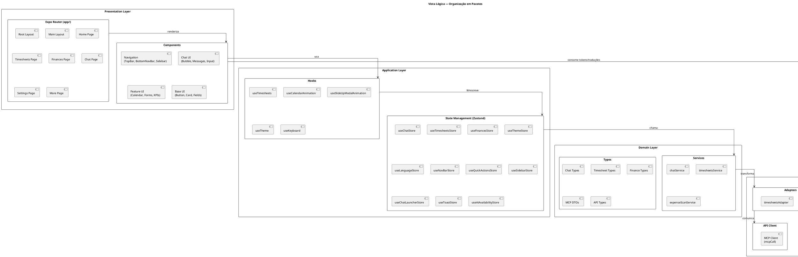
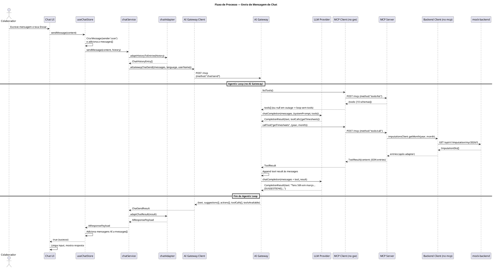
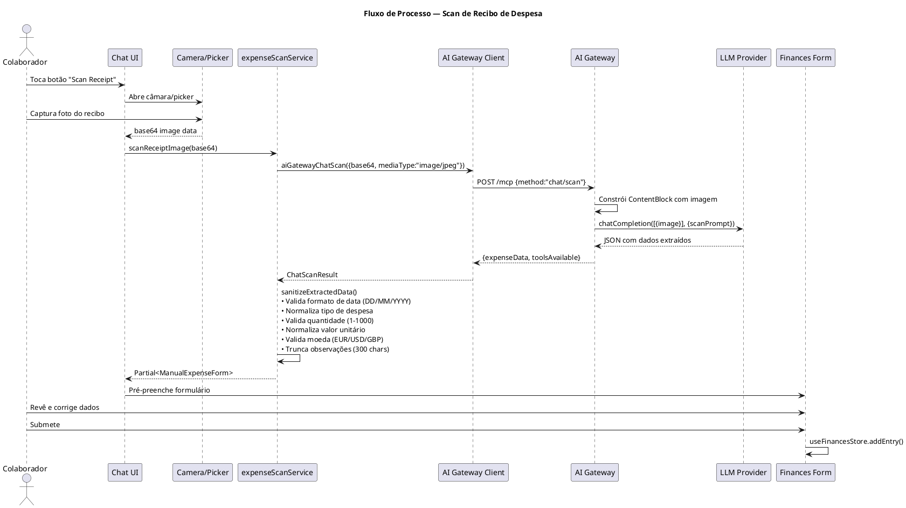
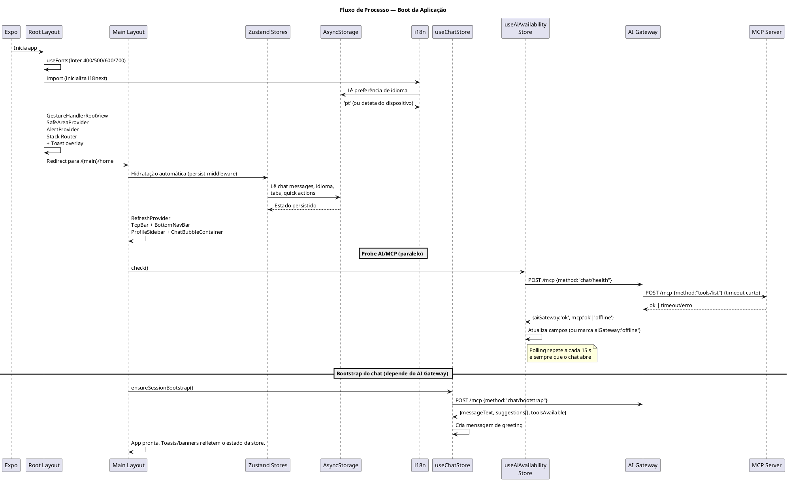
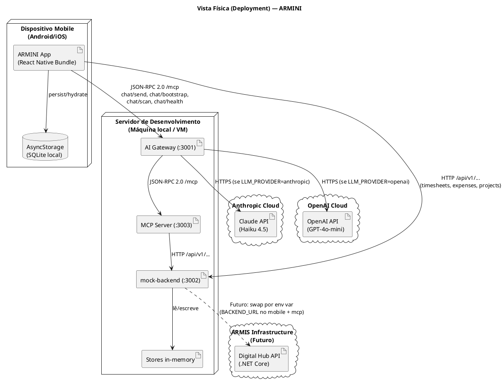
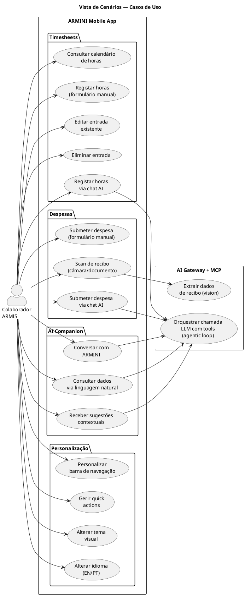
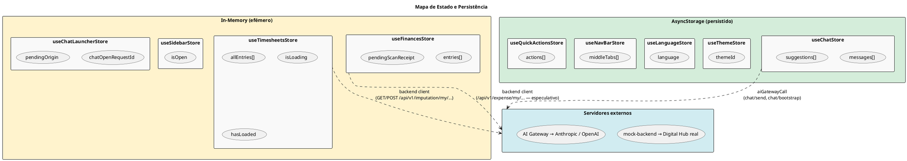
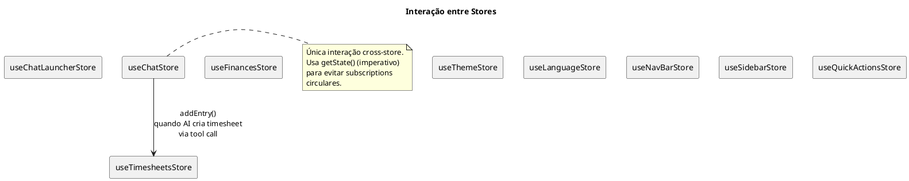

# ARMINI — Documentação de Arquitetura

> Port mobile do Digital Hub da ARMIS Group. Estágio curricular LEI-ISEP, fevereiro a julho 2026.

> **Atualizado em 2026-05-25 (Phase 9).** O sistema é hoje um monorepo de quatro processos: `armini/` (mobile), `ai-gateway/` (orquestração LLM), `mcp/` (host de tools) e `mock-backend/` (espelho do contrato .NET). Substituiu o layout anterior `mcp-server/` único — ver `REFACTOR_PLAN.md` para o historial.

---

## Índice

1. [Visão Geral](#1-visão-geral)
2. [Modelo C4](#2-modelo-c4)
   - [Nível 1 — Contexto do Sistema](#21-nível-1--contexto-do-sistema)
   - [Nível 2 — Containers](#22-nível-2--containers)
   - [Nível 3 — Componentes (App Mobile)](#23-nível-3--componentes-app-mobile)
   - [Nível 3 — Componentes (AI Gateway)](#24-nível-3--componentes-ai-gateway)
   - [Nível 3 — Componentes (MCP Server)](#25-nível-3--componentes-mcp-server)
3. [Vistas 4+1](#3-vistas-41)
   - [Vista Lógica](#31-vista-lógica)
   - [Vista de Processos](#32-vista-de-processos)
   - [Vista de Desenvolvimento](#33-vista-de-desenvolvimento)
   - [Vista Física (Deployment)](#34-vista-física-deployment)
   - [Vista de Cenários (Use Cases)](#35-vista-de-cenários-use-cases)
4. [Decisões Técnicas](#4-decisões-técnicas)
5. [Padrões Arquiteturais](#5-padrões-arquiteturais)
6. [Fluxos de Dados Detalhados](#6-fluxos-de-dados-detalhados)

---

## 1. Visão Geral

O ARMINI é uma aplicação mobile construída em **React Native** com **Expo**, destinada a colaboradores da ARMIS Group. Funciona como um hub digital pessoal com três capacidades core:

- **Gestão de Timesheets** — registo, edição e consulta de horas de trabalho
- **Submissão de Despesas** — entrada manual ou via fotografia de recibos com extração automática por IA
- **AI Companion (ARMINI)** — assistente conversacional contextual que integra dados de timesheets, despesas, projetos e perfil do colaborador

A arquitetura é um monorepo de **quatro processos** com responsabilidades isoladas:

- **`armini/`** — cliente mobile React Native (UI, estado, navegação).
- **`ai-gateway/`** — orquestrador LLM provider-agnostic. Único processo que detém chaves de API de LLM. Abstrai Anthropic (Claude) vs OpenAI (GPT) — trocar provider é mudar 1 env var.
- **`mcp/`** — host das tools que o LLM pode invocar, exposto via JSON-RPC ("MCP-shaped"). Stateless: cada handler proxia para o backend de dados.
- **`mock-backend/`** — espelho do contrato OpenAPI do Digital Hub (.NET), em memória. Trocar mock → real = mudar 1 env var em mobile + `mcp/`.

O mobile fala **apenas** com `ai-gateway/` (para chat) e `mock-backend/` (para dados). Nunca contacta `mcp/` diretamente — o gateway é o cliente MCP. Esta separação permite que uma queda do `mcp/` degrade graciosamente o chat (modo "limited") sem afetar a leitura/escrita de dados.

---

## 2. Modelo C4

### 2.1 Nível 1 — Contexto do Sistema

Mostra o sistema ARMINI, os seus utilizadores e os sistemas externos com que interage.

```plantuml
@startuml C4_Context
!include https://raw.githubusercontent.com/plantuml-stdlib/C4-PlantUML/master/C4_Context.puml

title Diagrama de Contexto do Sistema — ARMINI

Person(employee, "Colaborador ARMIS", "Utiliza a app mobile para gerir horas, despesas e consultar o assistente AI")

System(armini, "Sistema ARMINI", "Monorepo de 4 processos: mobile + AI Gateway + MCP server + mock backend")

System_Ext(anthropic, "Anthropic API", "Serviço cloud de LLM (Claude)")
System_Ext(openai, "OpenAI API", "Serviço cloud de LLM (GPT)")
System_Ext(digitalHub, "Digital Hub Backend", "API REST .NET Core existente (substituirá o mock-backend)")

Rel(employee, armini, "Usa", "Touch/Gestos")
Rel(armini, anthropic, "Prompts LLM (a partir do AI Gateway)", "HTTPS")
Rel(armini, openai, "Prompts LLM (a partir do AI Gateway)", "HTTPS")
Rel_R(armini, digitalHub, "Futuramente: chamadas REST do MCP + do mobile substituem o mock-backend", "HTTPS")

@enduml
```

**Narrativa:**

O colaborador interage exclusivamente com a app mobile. Apenas o **AI Gateway** detém credenciais de LLM — o cliente nunca contacta Anthropic/OpenAI diretamente. O **mock-backend** simula o contrato OpenAPI do Digital Hub e será substituído pela API real através de uma mudança de env var em `armini/` e `mcp/`, sem alterações de código.

---

### 2.2 Nível 2 — Containers

Detalha os containers (processos executáveis) que compõem o sistema.

```plantuml
@startuml C4_Containers
!include https://raw.githubusercontent.com/plantuml-stdlib/C4-PlantUML/master/C4_Container.puml

title Diagrama de Containers — ARMINI

Person(employee, "Colaborador ARMIS")

System_Boundary(arminiSystem, "Sistema ARMINI") {
    Container(mobileApp, "ARMINI Mobile App", "React Native / Expo / TypeScript", "UI mobile (Metro :8081). Expo Router. Backend client tipado contra swagger.json.")
    Container(aiGateway, "AI Gateway", "Node.js / Express / TS (:3001)", "Orquestrador LLM provider-agnostic. JSON-RPC 2.0: chat/send, chat/bootstrap, chat/scan, chat/health. Agentic loop. É cliente MCP.")
    Container(mcpServer, "MCP Server", "Node.js / Express / TS (:3003)", "Host stateless das 10 tools. JSON-RPC 2.0: tools/list, tools/call. Cada handler proxia para o backend.")
    Container(mockBackend, "Mock Backend", "Node.js / Express / TS (:3002)", "Espelho em memória do contrato OpenAPI do Digital Hub. Rotas /api/v1/...")
    ContainerDb(asyncStorage, "AsyncStorage", "React Native AsyncStorage", "Persiste preferências: mensagens de chat, idioma, navbar tabs, quick actions.")
    ContainerDb(memoryStore, "In-memory store", "JS Maps no mock-backend", "Imputations + projects + tasks + holidays + vacation + (especulativo) expenses. Reinicia ao restart.")
}

System_Ext(anthropic, "Anthropic API", "Claude Haiku 4.5")
System_Ext(openai, "OpenAI API", "GPT-4o-mini")
System_Ext(digitalHub, "Digital Hub Backend", ".NET Core REST API (substituirá o mock)")

Rel(employee, mobileApp, "Usa", "Touch")
Rel(mobileApp, aiGateway, "chat/send, chat/bootstrap, chat/scan, chat/health", "JSON-RPC 2.0 / HTTP")
Rel(mobileApp, mockBackend, "CRUD de timesheets, projetos, despesas", "HTTP /api/v1/...")
Rel(aiGateway, mcpServer, "tools/list (por chat), tools/call", "JSON-RPC 2.0 / HTTP")
Rel(mcpServer, mockBackend, "Mesmas rotas /api/v1/... que o mobile", "HTTP")
Rel(aiGateway, anthropic, "chatCompletion()", "HTTPS")
Rel(aiGateway, openai, "chatCompletion()", "HTTPS")
Rel(mobileApp, asyncStorage, "Lê/Escreve estado persistido")
Rel(mockBackend, memoryStore, "Lê/escreve seeds + mutações")
Rel_R(mockBackend, digitalHub, "Futuro: substituído por env-var swap (BACKEND_URL)", "HTTPS")

@enduml
```

**Narrativa:**

O sistema é composto por quatro processos:

1. **Mobile App** (`armini/`, Metro :8081) — gere UI, estado local (Zustand + AsyncStorage) e comunica com dois servidores: o **AI Gateway** para chat e o **mock-backend** para dados.
2. **AI Gateway** (`ai-gateway/` :3001) — orquestrador LLM. Recebe pedidos de chat, constrói prompts, executa o **agentic loop** delegando tool calls ao MCP, e devolve respostas estruturadas. Único processo com credenciais LLM. Provider-agnostic.
3. **MCP Server** (`mcp/` :3003) — host das tools. Stateless: cada handler proxia para o mock-backend através do mesmo contrato `/api/v1/...` que o mobile usa.
4. **Mock Backend** (`mock-backend/` :3002) — espelho em memória do contrato swagger do Digital Hub. Não persiste — restart = reset aos seeds. Substitui-se pela API real mudando uma env var (`EXPO_PUBLIC_BACKEND_URL` no mobile + `BACKEND_URL` no MCP).

O **AsyncStorage** persiste preferências de cliente (mensagens, idioma, tabs). O **AI Gateway é cliente MCP**: nunca chama tools in-process — sempre via HTTP para `mcp/`. Isto isola falhas (`mcp/` em baixo ≠ chat em baixo).

---

### 2.3 Nível 3 — Componentes (App Mobile)

Detalha a arquitetura interna da aplicação React Native.

```plantuml
@startuml C4_Components_Mobile
!include https://raw.githubusercontent.com/plantuml-stdlib/C4-PlantUML/master/C4_Component.puml

title Diagrama de Componentes — ARMINI Mobile App

Container_Boundary(mobileApp, "ARMINI Mobile App") {

    Component(routerLayer, "Expo Router Layer", "app/ directory", "File-based routing. Root layout, (main) layout group com TopBar/BottomNavBar, 6 rotas de página.")

    Component(navigationComponents, "Navigation Components", "TopBar, BottomNavBar, ProfileSidebar", "Barra superior com pull-to-refresh e botões, barra inferior com pill animada, sidebar modal de perfil.")

    Component(chatComponents, "Chat Components", "ChatBubbleContainer, ChatInput, ChatMessageList", "Modal de chat flutuante com animação expand-from-origin. Renderização markdown, suggestion chips, ações de despesa.")

    Component(featureComponents, "Feature Components", "CalendarGrid, EntryFormModal, ManualInvoiceEntry, KpiSection", "Componentes específicos de domínio: calendário interativo, formulários de timesheet e despesa, KPIs.")

    Component(uiComponents, "UI Components", "Button, Card, TextField, SelectField, DateField, ActionListRow", "Componentes reutilizáveis de UI. Design system consistente com theme tokens.")

    Component(hooks, "Custom Hooks", "useTimesheets, useCalendarAnimation, useSlideUpModalAnimation, useKeyboard, useTheme", "Hooks de lógica de domínio, animação e acesso a estado.")

    Component(stores, "Zustand Stores", "useChatStore, useTimesheetsStore, useFinancesStore, useAiAvailabilityStore, useToastStore, +5 mais", "10 stores hook-based. Persistência via AsyncStorage onde aplicável. Inclui useAiAvailabilityStore que rastreia estados independentes de ai-gateway e mcp.")

    Component(services, "Service Layer", "chatService, timesheetsService, expensesService, projectsService, expenseScanService", "Lógica de negócio assíncrona. Orquestra chamadas ao AI Gateway (chat) e ao backend client (dados).")

    Component(adapters, "Adapter Layer", "chatAdapter, timesheetsAdapter, expensesAdapter", "Transformação entre DTOs externos e modelos internos. ID int↔string, datas, envelopes BooleanFriendlyResponseT.")

    Component(aiGatewayClient, "AI Gateway Client", "src/services/api/aiGateway.ts", "JSON-RPC 2.0 client para o AI Gateway. aiGatewayCall<T>() + wrappers tipados (chat/send, chat/bootstrap, chat/scan, chat/health).")

    Component(backendClient, "Backend Client", "src/services/backend/", "Cliente HTTP tipado contra swagger.json. imputationsClient + projectsClient + expensesClient (especulativo). Headers x-api-key + x-corehub-claims-*.")

    Component(theme, "Theme System", "colors, typography, spacing, shadows", "4 temas (light/dark/blue/orange), tokens semânticos, font scale, grid de 4px.")

    Component(i18n, "i18n System", "i18next + react-i18next", "EN/PT com 7 namespaces. Deteção de idioma do dispositivo. Persistência da preferência.")
}

Rel(routerLayer, navigationComponents, "Renderiza")
Rel(routerLayer, featureComponents, "Renderiza nas rotas")
Rel(routerLayer, chatComponents, "Renderiza como overlay")
Rel(featureComponents, uiComponents, "Compõe")
Rel(featureComponents, hooks, "Usa")
Rel(chatComponents, hooks, "Usa")
Rel(hooks, stores, "Lê/Escreve estado")
Rel(stores, services, "Chama operações async")
Rel(services, adapters, "Transforma dados")
Rel(adapters, aiGatewayClient, "Usado por chatService / expenseScanService")
Rel(adapters, backendClient, "Usado por timesheetsService / expensesService / projectsService")
Rel_R(featureComponents, theme, "Consome tokens")
Rel_R(featureComponents, i18n, "Consome traduções")

@enduml
```

**Narrativa:**

A app segue uma arquitetura em camadas claras:

- **Router Layer** → define a estrutura de navegação e renderiza layouts. O Expo Router usa convenções de ficheiros para definir rotas, eliminando configuração manual.
- **Components** → divididos em 4 categorias: navegação (barra superior/inferior/sidebar), chat (o assistente AI), features (calendário, formulários, KPIs) e UI genérica (buttons, cards, fields). Os componentes de feature compõem os de UI, nunca o contrário.
- **Hooks** → ponte entre a UI e o estado/lógica. Hooks de domínio (useTimesheets) encapsulam lógica complexa; hooks de animação encapsulam setup de Reanimated.
- **Stores** → Zustand stores hook-based, cada um com responsabilidade bem definida. Sem Redux, sem Context pesado. Inclui `useAiAvailabilityStore` que mantém estados independentes para AI Gateway e MCP (driver dos banners "AI Companion offline" vs "Limited mode").
- **Services** → lógica de negócio pura (async functions), sem dependência de React. Dois grupos: services de chat usam o AI Gateway client; services de dados (timesheets, expenses, projects) usam o backend client.
- **Adapters** → camada de isolamento entre contratos externos e modelos internos. Quando o backend real chegar, só os adapters precisam de ser ajustados.
- **AI Gateway Client** → ponto único de contacto com o AI Gateway. `aiGatewayCall<T>()` + wrappers tipados.
- **Backend Client** → ponto único de contacto com o mock/real backend, contrato `/api/v1/...` do swagger. Trocar mock→real = mudar `EXPO_PUBLIC_BACKEND_URL`.

---

### 2.4 Nível 3 — Componentes (AI Gateway)

```plantuml
@startuml C4_Components_AIGateway
!include https://raw.githubusercontent.com/plantuml-stdlib/C4-PlantUML/master/C4_Component.puml

title Diagrama de Componentes — AI Gateway (`ai-gateway/`)

Container_Boundary(aiGateway, "AI Gateway (:3001)") {

    Component(transport, "HTTP Transport", "Express Router", "Endpoint POST /mcp. Métodos JSON-RPC 2.0: chat/send, chat/bootstrap, chat/scan, chat/health. (tools/* já não vivem aqui.)")

    Component(orchestrator, "Chat Orchestrator", "ChatOrchestrator", "Agentic loop com até N iterações. Fluxo LLM → tool call → LLM. Fetch do tool catalog via McpClient a cada chat/send. Em outage do MCP, corre sem tools com soft system instruction.")

    Component(promptBuilder, "Prompt Builder", "promptBuilder.ts", "Constrói system prompts: idioma, data corrente, identidade ARMINI. Prompt dedicado para scan de recibos. Soft instruction adicional quando toolsAvailable=false.")

    Component(responseParser, "Response Parser", "responseParser.ts", "Parsing de marcadores [SUGGESTIONS] e [EXPENSE_OPTIONS]. Extração e validação de JSON embebido.")

    Component(providerFactory, "Provider Factory", "createProvider()", "Instancia AnthropicProvider ou OpenAIProvider conforme env.LLM_PROVIDER.")

    Component(anthropicProvider, "Anthropic Provider", "AnthropicProvider", "Implementa LLMProvider. Adapta para o formato Anthropic, tool_use, preserva rawAssistantMessage.")

    Component(openaiProvider, "OpenAI Provider", "OpenAIProvider", "Implementa LLMProvider. Adapta para function calling do OpenAI.")

    Component(mcpClient, "MCP Client", "src/mcpClient/", "JSON-RPC-over-fetch para o MCP server. listTools() devolve null (não throw) em falha — base da degradação graciosa. callTool(name, args).")

    Component(config, "Config & Env", "Zod validation", "LLM_PROVIDER, ANTHROPIC_API_KEY, OPENAI_API_KEY, PORT, MCP_URL, MCP_TIMEOUT_MS. Constantes de modelo (haiku-4.5, gpt-4o-mini), temperatura, max tokens/iterations.")
}

Rel(transport, orchestrator, "Delega chat/* + chat/health")
Rel(orchestrator, promptBuilder, "Constrói system prompts")
Rel(orchestrator, responseParser, "Parseia respostas LLM")
Rel(orchestrator, providerFactory, "Obtém provider")
Rel(orchestrator, mcpClient, "listTools() por chat/send + callTool() no loop")
Rel(providerFactory, anthropicProvider, "Cria se LLM_PROVIDER=anthropic")
Rel(providerFactory, openaiProvider, "Cria se LLM_PROVIDER=openai")

@enduml
```

**Narrativa:**

O AI Gateway segue uma arquitetura **clean** com a mesma divisão do antigo `mcp-server/`, menos a parte de tools (carved-out para `mcp/`):

- **Transport** → camada HTTP pura. Aceita JSON-RPC 2.0, valida, roteia, serializa. Não tem lógica de negócio.
- **Orchestrator** → coração do servidor. **Agentic loop**: envia mensagens ao LLM, executa tool calls via MCP, alimenta resultados de volta, repete até resposta final (ou max iterations). Em outage do MCP, corre sem tools e adiciona uma soft instruction ao system prompt para o LLM recusar ações de dados.
- **Prompt Builder** → gera system prompts dinâmicos (idioma, data, identidade). Prompt separado para scan.
- **Response Parser** → extrai estrutura de texto livre. Marcadores convencionados (`[SUGGESTIONS]`, `[EXPENSE_OPTIONS]`) → JSON tipado.
- **Provider Abstraction** → interface `LLMProvider` com `chatCompletion()`. Duas implementações (Anthropic, OpenAI). Swap = 1 env var.
- **MCP Client** → JSON-RPC-over-fetch que liga ao `mcp/`. Crucial: `listTools()` devolve `null` em falha (não throw). Esta é a base do "limited mode" — o orchestrator vê `null` e corre o agentic loop sem tools.

---

### 2.5 Nível 3 — Componentes (MCP Server)

```plantuml
@startuml C4_Components_MCP
!include https://raw.githubusercontent.com/plantuml-stdlib/C4-PlantUML/master/C4_Component.puml

title Diagrama de Componentes — MCP Server (`mcp/`)

Container_Boundary(mcpServer, "MCP Server (:3003)") {

    Component(transport, "HTTP Transport", "Express Router", "Endpoint POST /mcp. Métodos JSON-RPC 2.0: tools/list, tools/call. (chat/* não vivem aqui.)")

    Component(toolRegistry, "Tool Registry", "ToolRegistry", "Map<name, {definition, handler}>. Lista as 10 tools e despacha tools/call para o handler.")

    Component(timesheetTools, "Timesheet Tools", "4 handlers", "getTimesheets, createTimesheetEntry, editTimesheetEntry, deleteTimesheetEntry.")

    Component(expenseTools, "Expense Tools", "4 handlers (especulativo)", "getExpenses, submitExpense, editExpense, deleteExpense. Tagged // TODO(expenses-contract).")

    Component(miscTools, "Misc Tools", "2 handlers", "getProjects, getEmployeeInfo (deriva de BACKEND_USERNAME — swagger não tem /me).")

    Component(backendClient, "Backend Client", "src/backend/", "fetch wrapper + imputationsClient + projectsClient + expensesClient. Mesmo contrato /api/v1/... que o mobile usa.")

    Component(adapters, "Adapters", "imputationsAdapter, expensesAdapter, projectTaskResolver", "DTO ↔ shape interno. Envelopes BooleanFriendlyResponseT, ID int↔string, datas.")

    Component(config, "Config & Env", "Zod validation", "MCP_PORT, BACKEND_URL, BACKEND_API_KEY, BACKEND_USERNAME, BACKEND_TIMEOUT_MS.")
}

Container_Ext(mockBackend, "mock-backend (:3002)", "ou Digital Hub real")

Rel(transport, toolRegistry, "Delega tools/list e tools/call")
Rel(toolRegistry, timesheetTools, "Regista e invoca")
Rel(toolRegistry, expenseTools, "Regista e invoca")
Rel(toolRegistry, miscTools, "Regista e invoca")
Rel(timesheetTools, backendClient, "Usa imputationsClient + projectsClient")
Rel(expenseTools, backendClient, "Usa expensesClient")
Rel(miscTools, backendClient, "Usa projectsClient (getProjects)")
Rel(backendClient, adapters, "Mapeia DTOs")
Rel(backendClient, mockBackend, "HTTP /api/v1/...")

@enduml
```

**Narrativa:**

O MCP server é deliberadamente fino:

- **Transport** → idêntico ao do gateway, mas só expõe `tools/list` e `tools/call`. POSTing `chat/*` aqui devolve method-not-found.
- **Tool Registry** → registo declarativo das 10 tools. Cada tool é um `{definition, handler}`. O catalog devolvido por `tools/list` vai para o LLM como tool schema.
- **Handlers** → stateless. Recebem args validados, chamam o backend client, devolvem `ToolResult` (sucesso ou erro estruturado). Toda a persistência vive no `mock-backend/` (ou na API real quando ligada).
- **Backend Client** → simétrico ao do mobile. Mesma URL base (`/api/v1/...`), mesmos headers (`x-api-key`, `x-corehub-claims-*` — stub). Mesma swap-via-env-var.
- **Adapters** → tradução boundary entre DTOs do contrato e a shape que o LLM consome (e.g., int IDs → string, envelopes desempacotados, datas normalizadas).

---

## 3. Vistas 4+1

### 3.1 Vista Lógica

Mostra a organização lógica do sistema em pacotes e as suas dependências.



**Narrativa:**

A arquitetura segue uma **hierarquia de dependências unidirecional** de cima para baixo:

1. **Presentation** → conhece Components e Router. Nunca importa services ou API diretamente.
2. **Application** → Hooks e Stores. Hooks encapsulam lógica complexa que a UI consome como valores reactivos. Stores gerem estado global com actions que delegam a services.
3. **Domain** → Services de domínio com lógica de negócio pura. Types definem contratos.
4. **Infrastructure** → Adapters isolam formatos externos, API Client gere comunicação HTTP, Cross-cutting fornece tokens visuais e traduções.

**Regra chave**: a UI nunca importa adapters nem a API client diretamente. Toda a comunicação passa por services, que por sua vez usam adapters. Esta camada de indireção permite que mudanças no backend (formato de resposta, endpoints) fiquem contidas nos adapters sem propagar para a UI.

---

### 3.2 Vista de Processos

Mostra o comportamento dinâmico do sistema — como os processos comunicam em runtime.

#### 3.2.1 Fluxo de Chat (Envio de Mensagem)



**Nota:** quando o `mcp/` está em baixo, `mcpClient.listTools()` devolve `null` e o agentic loop corre sem catálogo de tools — `toolsAvailable=false` flui de volta até à UI para o banner "Limited mode". Mutações via tool (criar/editar timesheet a partir do chat) deixam de funcionar nesse modo; o utilizador pode ainda fazer CRUD pelo backend client diretamente.

#### 3.2.2 Fluxo de Scan de Recibo



#### 3.2.3 Fluxo de Boot da Aplicação



---

### 3.3 Vista de Desenvolvimento

Mostra a organização do código-fonte em módulos e as suas dependências de build.

```plantuml
@startuml Vista_Desenvolvimento
skinparam packageStyle rectangle

title Vista de Desenvolvimento — Organização de Módulos

package "armini/ (React Native App)" {

    package "app/" <<Folder>> {
        [_layout.tsx\n(Root Layout)]
        [index.tsx\n(Redirect)]
        package "(main)/" <<Folder>> {
            [_layout.tsx\n(Main Layout)]
            [home/]
            [finances/]
            [timesheets/]
            [whistleblow/]
            [settings/]
            [more/]
        }
    }

    package "src/" <<Folder>> {
        package "components/" <<Folder>> {
            [navigation/]
            [chat/]
            [home/]
            [timesheets/]
            [finances/]
            [settings/]
            [ui/]
        }

        package "stores/" <<Folder>> {
            [9 Zustand stores]
        }

        package "services/" <<Folder>> {
            [api/mcp.ts]
            [adapters/]
            [chat/]
            [timesheets/]
            [finances/]
        }

        package "hooks/" <<Folder>> {
            [9 custom hooks]
        }

        package "types/" <<Folder>> {
            [7 type modules]
        }

        package "theme/" <<Folder>> {
            [colors, typography,\nspacing, shadows]
        }

        package "i18n/" <<Folder>> {
            [index.ts + locales/\n{en,pt}/]
        }

        package "constants/" <<Folder>> {
            [10 constant modules]
        }

        package "contexts/" <<Folder>> {
            [RefreshContext\nAlertContext]
        }
    }
}

package "ai-gateway/ (Node.js, :3001)" {
    package "src/" <<Folder>> {
        [config/]
        [providers/]
        [orchestrator/]
        [mcpClient/]
        [transport/]
        [utils/]
        [index.ts]
    }
}

package "mcp/ (Node.js, :3003)" {
    package "src/" <<Folder>> {
        [config/]
        [tools/]
        [backend/ (httpClient + clients + adapters)]
        [transport/]
        [utils/]
        [index.ts]
    }
}

package "mock-backend/ (Node.js, :3002)" {
    package "src/" <<Folder>> {
        [routes/]
        [data/ (stores + fixtures)]
        [types/]
        [utils/]
        [index.ts]
    }
}

@enduml
```

**Narrativa:**

O projeto é um **monorepo** com quatro aplicações adjacentes:

1. **armini/** — a app React Native com Expo. File-based routing (`app/`) e `src/` organizado por responsabilidade (components, stores, services, etc.). Componentes agrupados por feature.

2. **ai-gateway/** — orquestrador LLM. Camadas funcionais: config, providers (abstração LLM), orchestrator (chat + agentic loop), mcpClient (cliente para `mcp/`), transport (HTTP), utils.

3. **mcp/** — host das tools. config, tools (10 handlers + registry), backend (httpClient + clients + adapters), transport, utils. Stateless.

4. **mock-backend/** — espelho do swagger. routes (uma por recurso), data (stores in-memory + fixtures JSON), types (DTOs derivados do swagger), utils.

**Convenções de organização:**
- Componentes agrupados por **feature**, não por tipo técnico
- Cada store é 1 ficheiro = 1 domínio
- Cada service é 1 ficheiro = 1 feature
- Types separados por domínio para evitar ficheiros monolíticos
- Constants centralizadas para evitar magic numbers/strings

---

### 3.4 Vista Física (Deployment)

Mostra a topologia de deployment e comunicação entre nós.



**Narrativa:**

Em desenvolvimento, os três processos Node correm na máquina local (mesmo PC, portas 3001/3002/3003). A app mobile conecta-se via IP da rede local (Metro injeta-o automaticamente). Em produção, o `mock-backend/` é substituído pelo Digital Hub real através de env vars em `armini/` e `mcp/` — sem alterações de código.

**Comunicação:**
- **App → AI Gateway** (port 3001): JSON-RPC 2.0 sobre HTTP em dev; HTTPS em produção. Inclui `chat/health` para a UI saber o estado dos servidores.
- **App → mock-backend** (port 3002): HTTP REST `/api/v1/...`. Substituído pelo Digital Hub real via `EXPO_PUBLIC_BACKEND_URL`.
- **AI Gateway → MCP Server** (port 3003): JSON-RPC 2.0. Falha aqui = "Limited mode" no mobile (chat sem tools).
- **MCP Server → mock-backend** (port 3002): mesmo endpoint que o mobile usa. Trocar para o Digital Hub real via `BACKEND_URL` no `.env` do MCP.
- **AI Gateway → LLM**: sempre HTTPS. `LLM_PROVIDER` controla qual.

---

### 3.5 Vista de Cenários (Use Cases)

Mostra os casos de uso do sistema e como os atores interagem.



**Narrativa:**

Os use cases dividem-se em 4 grupos:

1. **Timesheets** — gestão direta de horas (CRUD) via calendário interativo ou via chat (o AI cria entradas chamando tools no server).
2. **Despesas** — submissão manual ou assistida por IA. O scan de recibo usa vision do LLM para extrair dados de imagem/documento.
3. **AI Companion** — conversação livre, consulta de dados (timesheets, projetos, perfil) via linguagem natural, e sugestões contextuais que o LLM gera em cada resposta.
4. **Personalização** — configuração da experiência (tema, idioma, tabs da navbar, quick actions).

Os use cases que envolvem IA (UC5, UC7-UC11) delegam ao **AI Gateway**, que executa o agentic loop e delega tool calls ao **MCP server**. Os de leitura/escrita pura de dados (UC1-UC4, UC6) vão diretos do mobile ao **mock-backend** sem passar por IA.

---

## 4. Decisões Técnicas

### 4.1 Porquê Expo Router em vez de React Navigation?

O Expo Router usa **file-based routing** — cada ficheiro em `app/` é automaticamente uma rota. Isto elimina ficheiros de configuração de navegação, reduz boilerplate, e alinhas a estrutura de pastas com a estrutura de navegação. A convenção de **layout groups** (`(main)/`) permite partilhar UI (TopBar, BottomNavBar) entre rotas sem wrapping manual.

**Tradeoff**: Menor flexibilidade para navegação programática complexa. Mitigado pelo facto de a app ter uma estrutura de navegação simples (flat, sem deep nesting).

### 4.2 Porquê Zustand em vez de Redux ou Context?

Zustand é **minimal e hook-native**. Cada store é uma função que retorna estado e ações — sem providers, reducers, action creators, ou middleware complexo. A integração com AsyncStorage para persistência é direta (middleware `persist`).

**9 stores pequenos** em vez de 1 monolítico: cada store gere 1 domínio. Isto evita re-renders desnecessários (subscribes granulares) e facilita a manutenção.

**Cross-store communication** existe apenas num caso: `useChatStore` chama `useTimesheetsStore.getState().addEntry()` quando o AI cria uma entrada de timesheet via tool call. Usa `getState()` (acesso imperativo) em vez de subscribe para evitar dependências circulares.

### 4.3 Porquê quatro processos separados (mobile + AI Gateway + MCP + mock-backend)?

Quatro razões, uma por boundary:

1. **Mobile separado do AI Gateway — segurança e provider-swap.** API keys de LLM nunca chegam ao cliente. O Gateway é o único processo com credenciais. Trocar Anthropic↔OpenAI é mudar 1 env var no Gateway; o cliente nem sabe.
2. **AI Gateway separado do MCP — isolamento de falhas e responsabilidades.** Antes, um `mcp-server/` único punha LLM e tools no mesmo processo: qualquer falha derrubava tudo. Separando, uma queda do `mcp/` deixa o chat responder em "limited mode" (sem tools) e a leitura/escrita de dados não é afetada. Tornar o Gateway um cliente MCP HTTP também abre a porta a substituir o `mcp/` por um servidor MCP-protocol completo no futuro.
3. **MCP separado do backend — stateless e testável.** O `mcp/` não detém estado, só schemas + handlers. Cada handler é uma chamada HTTP fina ao backend. O agentic loop fica isolado dos detalhes de persistência.
4. **mock-backend separado de tudo — fonte única de verdade.** Mobile e MCP atingem o mesmo endpoint `/api/v1/...`. Swap mock→real = mudar `BACKEND_URL` nos dois consumidores. O contrato em `swagger.json` é a referência canónica.

Decisão preservada: **agentic loop server-side**, não no cliente. Múltiplas iterações LLM→tool→LLM seriam impraticáveis em mobile (latência, bateria, complexidade).

### 4.4 Porquê JSON-RPC 2.0?

Protocolo simples, stateless, e facilmente testável. Cada pedido tem um `method` e `params`; cada resposta tem `result` ou `error`. Não precisa de WebSockets (as interações são request-response). Alinha com o conceito de MCP (Model Context Protocol) que é baseado em JSON-RPC.

### 4.5 Porquê o Adapter Pattern?

Os adapters (`chatAdapter`, `timesheetsAdapter`) isolam o formato das respostas externas dos modelos internos. Quando a API real do Digital Hub for integrada (formato diferente dos mocks), só os adapters precisam de mudar. A UI, stores e services permanecem intactos.

**Exemplo concreto**: `timesheetsAdapter` lida com inconsistências como `project` vs `project_name`, `hours` como string vs número, e status defaults. Este tipo de normalização ficaria espalhado pelo código sem o adapter.

### 4.6 Porquê Reanimated para animações?

React Native Reanimated 3 executa animações na **UI thread** (via worklets), garantindo 60fps mesmo em interações complexas. As animações core da app (page transitions, calendar swipe, pill highlight, modal expand) são todas feitas em Reanimated.

**Regra fundamental**: nunca escrever para `.value` de shared values durante render (causa saltos visuais). Animações de entrada/saída de componentes usam `entering`/`exiting` (UI thread desde o 1º frame).

### 4.7 Porquê tool calling em vez de RAG?

Em vez de injectar contexto via Retrieval-Augmented Generation (pré-carregar dados no prompt), o ARMINI usa **tool calling**: o LLM decide quando precisa de dados e chama tools explicitamente. Isto é mais eficiente (não carrega dados desnecessários), mais preciso (o LLM pede exactamente o que precisa), e mais seguro (o system prompt não contém dados do utilizador).

### 4.8 Porquê marcadores de texto ([SUGGESTIONS]) em vez de function calling para UI actions?

O LLM responde com texto que contém marcadores convencionados (`[SUGGESTIONS]`, `[EXPENSE_OPTIONS]`). O Response Parser extrai-os e transforma em dados tipados. Esta abordagem é mais simples que obrigar o LLM a fazer uma tool call separada para cada sugestão — funciona com qualquer provider e é fácil de debugar.

### 4.9 Porquê 4 temas (light/dark/blue/orange)?

Design system com tokens semânticos. Cada tema define 43+ cores com nomes como `textPrimary`, `chatBubbleUser`, `statusApproved`. Mudar de tema é mudar o mapa de tokens. Componentes nunca usam cores hardcoded — sempre consomem via `useTheme()`.

### 4.10 Porquê i18n com namespaces por feature?

7 namespaces (`common`, `home`, `finances`, `timesheets`, `chat`, `settings`, `more`) correspondem às áreas da app. Cada namespace é um ficheiro JSON por idioma. Isto permite:
- Carregar traduções on-demand (se necessário no futuro)
- Encontrar rapidamente a tradução de uma string (o namespace diz a feature)
- Evitar colisões de chaves entre features

---

## 5. Padrões Arquiteturais

### 5.1 Layered Architecture (Cliente)

```
Presentation → Application → Domain → Infrastructure
```

Cada camada só depende da camada abaixo. A UI nunca importa a API client diretamente.

### 5.2 Provider Pattern (Servidor)

Interface `LLMProvider` com `chatCompletion()`. Duas implementações concretas. Factory `createProvider()` instancia a correcta. Princípio Open/Closed: adicionar um terceiro provider (e.g., Gemini) = criar 1 ficheiro novo + 1 case no factory.

### 5.3 Adapter Pattern (Cliente)

Adapters convertem entre formatos externos (MCP DTOs) e modelos internos. Barreira de proteção contra mudanças de API.

### 5.4 Agentic Loop Pattern (Servidor)

```
WHILE not done AND iterations < max:
    response = LLM(messages)
    IF response has tool_calls:
        results = execute_tools(response.tool_calls)
        messages += [assistant_message, tool_results]
    ELSE:
        done = true
```

Permite reasoning multi-step: o LLM pode primeiro consultar timesheets, depois criar uma entrada, e finalmente reportar o resultado — tudo numa única interação do utilizador.

### 5.5 Request/Consume Pattern (Cliente)

Usado para coordenação cross-component sem coupling direto:
- `useChatLauncherStore.requestOpenChat(x, y)` — qualquer componente pode pedir para abrir o chat
- `MainLayout` consome o pedido e abre o `ChatBubbleContainer` nas coordenadas

Mesmo padrão em `useFinancesStore.requestScanReceipt()` / `consumeScanReceipt()`.

### 5.6 Composable Hooks Pattern (Cliente)

Hooks complexos compõem hooks mais simples:
- `useTimesheets` usa `useTimesheetsStore` + `useMemo` + estado local de navegação
- `useCalendarAnimation` usa `useSharedValue` + `useAnimatedStyle` + `Gesture.Pan()`
- `useSlideUpModalAnimation` encapsula setup de modal slide-up reutilizável

---

## 6. Fluxos de Dados Detalhados

### 6.1 Estado e Persistência



### 6.2 Interação entre Stores



**Narrativa sobre isolamento de stores:**

Os 9 stores são quase totalmente independentes. A **única exceção** é `useChatStore` → `useTimesheetsStore`: quando o LLM executa a tool `createTimesheetEntry` durante uma conversa, o chat store cria a entrada no timesheets store usando `getState().addEntry()`. Esta comunicação é **imperativa** (não reactiva) para evitar re-renders em cascata.

Todos os outros stores são silos isolados, cada um gerindo o seu domínio. A comunicação entre features acontece na camada de UI (e.g., a home page lê vários stores para mostrar KPIs) ou via padrões de coordenação (request/consume para chat launcher e scan receipt).

---

> **Nota**: Os diagramas PlantUML podem ser renderizados em qualquer ferramenta compatível (PlantUML Online, IntelliJ, VS Code com extensão PlantUML, etc.). Para diagramas C4, é necessário o include do C4-PlantUML stdlib.
