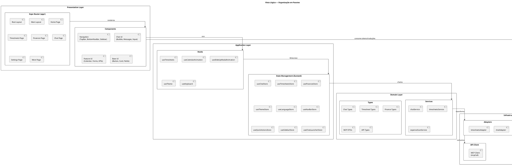
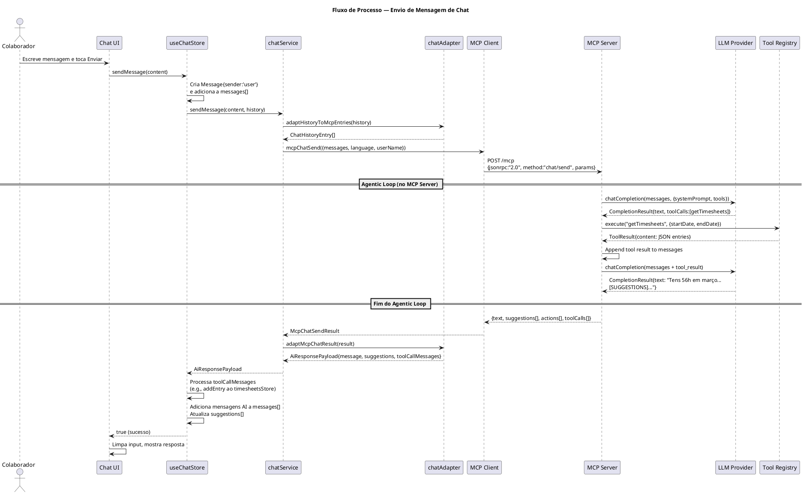
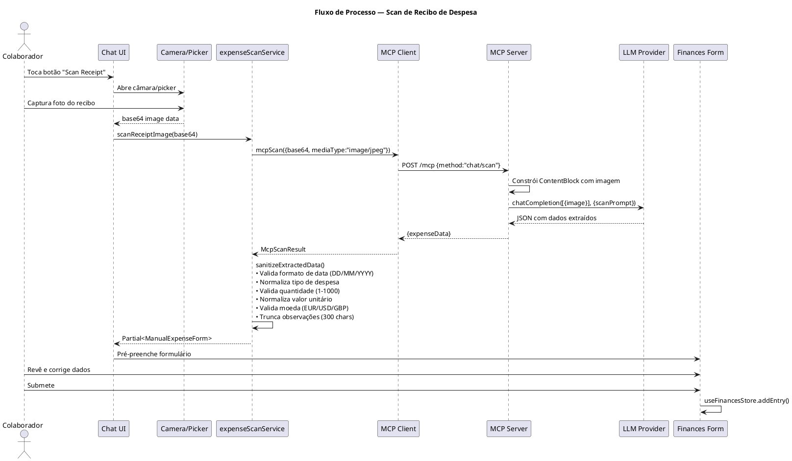
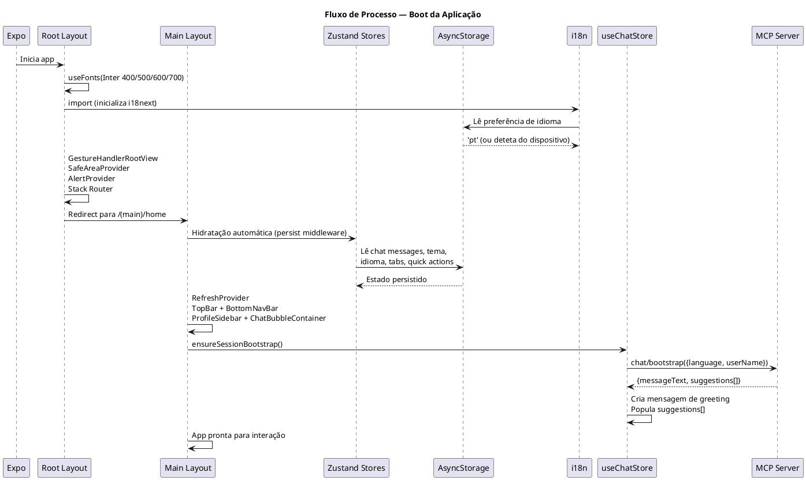
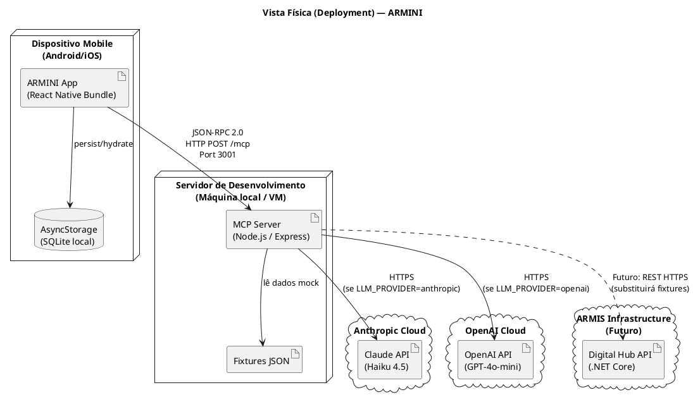
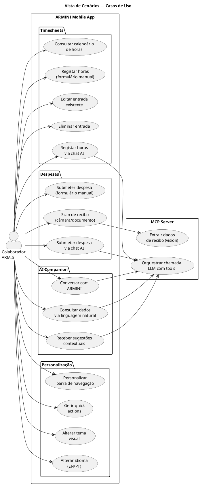
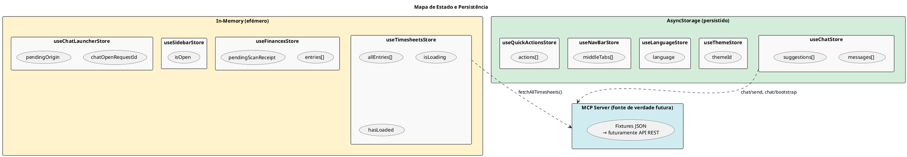
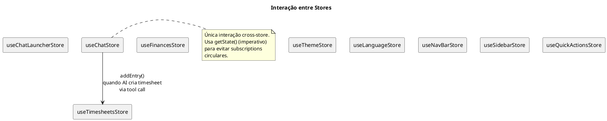

# ARMINI — Documentação de Arquitetura

> Port mobile do Digital Hub da ARMIS Group. Estágio curricular LEI-ISEP, fevereiro a julho 2026.

---

## Índice

1. [Visão Geral](#1-visão-geral)
2. [Modelo C4](#2-modelo-c4)
   - [Nível 1 — Contexto do Sistema](#21-nível-1--contexto-do-sistema)
   - [Nível 2 — Containers](#22-nível-2--containers)
   - [Nível 3 — Componentes (App Mobile)](#23-nível-3--componentes-app-mobile)
   - [Nível 3 — Componentes (MCP Server)](#24-nível-3--componentes-mcp-server)
3. [Vistas 4+1](#3-vistas-41)
   - [Vista Lógica](#31-vista-lógica)
   - [Vista de Processos](#32-vista-de-processos)
   - [Vista de Desenvolvimento](#33-vista-de-desenvolvimento)
   - [Vista Física (Deployment)](#34-vista-física-deployment)
   - [Vista de Cenários (Use Cases)](#35-vista-de-cenários-use-cases)
4. [Decisões Técnicas](#4-decisões-técnicas)
5. [Padrões Arquiteturais](#5-padrões-arquiteturais)
6. [Fluxos de Dados Detalhados](#6-fluxos-de-dados-detalhados)

---

## 1. Visão Geral

O ARMINI é uma aplicação mobile construída em **React Native** com **Expo**, destinada a colaboradores da ARMIS Group. Funciona como um hub digital pessoal com três capacidades core:

- **Gestão de Timesheets** — registo, edição e consulta de horas de trabalho
- **Submissão de Despesas** — entrada manual ou via fotografia de recibos com extração automática por IA
- **AI Companion (ARMINI)** — assistente conversacional contextual que integra dados de timesheets, despesas, projetos e perfil do colaborador

A arquitetura segue um modelo **client-server desacoplado**: a app mobile é um cliente leve que delega toda a lógica de IA a um **MCP Server** (Model Context Protocol) próprio. O MCP Server é **provider-agnostic** — abstrai a diferença entre Anthropic (Claude) e OpenAI (GPT), permitindo trocar de fornecedor de LLM sem impacto no cliente.

---

## 2. Modelo C4

### 2.1 Nível 1 — Contexto do Sistema

Mostra o sistema ARMINI, os seus utilizadores e os sistemas externos com que interage.

```plantuml
@startuml C4_Context
!include https://raw.githubusercontent.com/plantuml-stdlib/C4-PlantUML/master/C4_Context.puml

title Diagrama de Contexto do Sistema — ARMINI

Person(employee, "Colaborador ARMIS", "Utiliza a app mobile para gerir horas, despesas e consultar o assistente AI")

System(armini, "ARMINI Mobile App", "Aplicação React Native que serve como hub digital pessoal do colaborador")

System_Ext(mcpServer, "MCP Server", "Servidor Node.js que orquestra chamadas LLM e disponibiliza tools mock da API ARMIS")
System_Ext(anthropic, "Anthropic API", "Serviço cloud de LLM (Claude)")
System_Ext(openai, "OpenAI API", "Serviço cloud de LLM (GPT)")
System_Ext(digitalHub, "Digital Hub Backend", "API REST .NET Core existente (futuro)")

Rel(employee, armini, "Usa", "Touch/Gestos")
Rel(armini, mcpServer, "Envia mensagens, pede bootstrap, scan de recibos", "JSON-RPC 2.0 / HTTP")
Rel(mcpServer, anthropic, "Envia prompts, recebe completions", "HTTPS")
Rel(mcpServer, openai, "Envia prompts, recebe completions", "HTTPS")
Rel_R(mcpServer, digitalHub, "Futuramente: chamadas REST para dados reais", "HTTPS")

@enduml
```

**Narrativa:**

O colaborador ARMIS interage exclusivamente com a app mobile. A app nunca contacta APIs de LLM diretamente — toda a comunicação com modelos de linguagem passa pelo MCP Server. Este servidor é o único ponto de contacto com fornecedores de IA e, futuramente, com o backend real do Digital Hub. Atualmente, o MCP Server opera com **dados mock** (fixtures JSON) que simulam a API ARMIS.

---

### 2.2 Nível 2 — Containers

Detalha os containers (processos executáveis) que compõem o sistema.

```plantuml
@startuml C4_Containers
!include https://raw.githubusercontent.com/plantuml-stdlib/C4-PlantUML/master/C4_Container.puml

title Diagrama de Containers — ARMINI

Person(employee, "Colaborador ARMIS")

System_Boundary(arminiSystem, "Sistema ARMINI") {
    Container(mobileApp, "ARMINI Mobile App", "React Native / Expo / TypeScript", "UI mobile com gestão de timesheets, despesas e chat AI. Expo Router para navegação file-based.")
    Container(mcpServer, "MCP Server", "Node.js / Express / TypeScript", "Orquestrador LLM provider-agnostic. Expõe JSON-RPC 2.0 via HTTP. Agentic loop com tool calling.")
    ContainerDb(asyncStorage, "AsyncStorage", "React Native AsyncStorage", "Persiste preferências do utilizador: mensagens de chat, tema, idioma, tabs de navegação, quick actions.")
    ContainerDb(fixtures, "Fixtures JSON", "Ficheiros JSON estáticos", "Dados mock que simulam a API ARMIS: timesheets, despesas, projetos, perfil do colaborador.")
}

System_Ext(anthropic, "Anthropic API", "Claude Haiku 4.5")
System_Ext(openai, "OpenAI API", "GPT-4o-mini")

Rel(employee, mobileApp, "Usa", "Touch")
Rel(mobileApp, mcpServer, "chat/send, chat/bootstrap, chat/scan", "JSON-RPC 2.0 / HTTP POST /mcp")
Rel(mobileApp, asyncStorage, "Lê/Escreve estado persistido")
Rel(mcpServer, fixtures, "Lê dados mock")
Rel(mcpServer, anthropic, "chatCompletion()", "HTTPS")
Rel(mcpServer, openai, "chatCompletion()", "HTTPS")

@enduml
```

**Narrativa:**

O sistema é composto por dois processos principais:

1. **Mobile App** — o cliente React Native, que gere toda a UI, estado local (Zustand + AsyncStorage) e comunicação com o MCP Server via JSON-RPC 2.0.
2. **MCP Server** — o backend de orquestração AI. Recebe pedidos da app, constrói prompts com contexto, executa um **agentic loop** (o LLM pode chamar tools iterativamente), e devolve respostas estruturadas.

O **AsyncStorage** persiste dados que sobrevivem ao restart da app (mensagens de chat, preferências). Os **Fixtures JSON** são uma camada de dados temporária no servidor que simula respostas de API real até a integração com o Digital Hub.

---

### 2.3 Nível 3 — Componentes (App Mobile)

Detalha a arquitetura interna da aplicação React Native.

```plantuml
@startuml C4_Components_Mobile
!include https://raw.githubusercontent.com/plantuml-stdlib/C4-PlantUML/master/C4_Component.puml

title Diagrama de Componentes — ARMINI Mobile App

Container_Boundary(mobileApp, "ARMINI Mobile App") {

    Component(routerLayer, "Expo Router Layer", "app/ directory", "File-based routing. Root layout, (main) layout group com TopBar/BottomNavBar, 6 rotas de página.")

    Component(navigationComponents, "Navigation Components", "TopBar, BottomNavBar, ProfileSidebar", "Barra superior com pull-to-refresh e botões, barra inferior com pill animada, sidebar modal de perfil.")

    Component(chatComponents, "Chat Components", "ChatBubbleContainer, ChatInput, ChatMessageList", "Modal de chat flutuante com animação expand-from-origin. Renderização markdown, suggestion chips, ações de despesa.")

    Component(featureComponents, "Feature Components", "CalendarGrid, EntryFormModal, ManualInvoiceEntry, KpiSection", "Componentes específicos de domínio: calendário interativo, formulários de timesheet e despesa, KPIs.")

    Component(uiComponents, "UI Components", "Button, Card, TextField, SelectField, DateField, ActionListRow", "Componentes reutilizáveis de UI. Design system consistente com theme tokens.")

    Component(hooks, "Custom Hooks", "useTimesheets, useCalendarAnimation, useSlideUpModalAnimation, useKeyboard, useTheme", "Hooks de lógica de domínio, animação e acesso a estado.")

    Component(stores, "Zustand Stores", "useChatStore, useTimesheetsStore, useFinancesStore, +6 mais", "9 stores hook-based. 5 persistidos via AsyncStorage. Gestão de estado por domínio.")

    Component(services, "Service Layer", "chatService, timesheetsService, expenseScanService", "Lógica de negócio assíncrona. Orquestra chamadas à API e transformação de dados.")

    Component(adapters, "Adapter Layer", "chatAdapter, timesheetsAdapter", "Transformação entre DTOs da API (MCP) e modelos de domínio internos. Isolamento de contratos externos.")

    Component(apiClient, "MCP Client", "mcp.ts", "Cliente HTTP genérico para JSON-RPC 2.0. mcpCall<T>() + wrappers tipados por método.")

    Component(theme, "Theme System", "colors, typography, spacing, shadows", "4 temas (light/dark/blue/orange), tokens semânticos, font scale, grid de 4px.")

    Component(i18n, "i18n System", "i18next + react-i18next", "EN/PT com 7 namespaces. Deteção de idioma do dispositivo. Persistência da preferência.")
}

Rel(routerLayer, navigationComponents, "Renderiza")
Rel(routerLayer, featureComponents, "Renderiza nas rotas")
Rel(routerLayer, chatComponents, "Renderiza como overlay")
Rel(featureComponents, uiComponents, "Compõe")
Rel(featureComponents, hooks, "Usa")
Rel(chatComponents, hooks, "Usa")
Rel(hooks, stores, "Lê/Escreve estado")
Rel(stores, services, "Chama operações async")
Rel(services, adapters, "Transforma dados")
Rel(adapters, apiClient, "Usa")
Rel_R(featureComponents, theme, "Consome tokens")
Rel_R(featureComponents, i18n, "Consome traduções")

@enduml
```

**Narrativa:**

A app segue uma arquitetura em camadas claras:

- **Router Layer** → define a estrutura de navegação e renderiza layouts. O Expo Router usa convenções de ficheiros para definir rotas, eliminando configuração manual.
- **Components** → divididos em 4 categorias: navegação (barra superior/inferior/sidebar), chat (o assistente AI), features (calendário, formulários, KPIs) e UI genérica (buttons, cards, fields). Os componentes de feature compõem os de UI, nunca o contrário.
- **Hooks** → ponte entre a UI e o estado/lógica. Hooks de domínio (useTimesheets) encapsulam lógica complexa; hooks de animação encapsulam setup de Reanimated.
- **Stores** → Zustand stores hook-based, cada um com responsabilidade bem definida. Sem Redux, sem Context pesado. 5 dos 9 stores são persistidos.
- **Services** → lógica de negócio pura (async functions), sem dependência de React. Orquestram chamadas à API e delegam transformação aos adapters.
- **Adapters** → camada de isolamento entre contratos externos (DTOs da API) e modelos internos. Quando o backend mudar, só os adapters precisam de ser ajustados.
- **API Client** → um único ponto de contacto com o MCP Server. `mcpCall<T>()` genérico com abort controller, timeout e error handling.

---

### 2.4 Nível 3 — Componentes (MCP Server)

```plantuml
@startuml C4_Components_Server
!include https://raw.githubusercontent.com/plantuml-stdlib/C4-PlantUML/master/C4_Component.puml

title Diagrama de Componentes — MCP Server

Container_Boundary(mcpServer, "MCP Server") {

    Component(transport, "HTTP Transport", "Express Router", "Endpoint POST /mcp. Validação JSON-RPC 2.0. Routing por método (chat/send, chat/bootstrap, chat/scan, tools/list, tools/call).")

    Component(orchestrator, "Chat Orchestrator", "ChatOrchestrator class", "Agentic loop com até 10 iterações. Gere fluxo LLM → tool call → LLM. handleChat(), handleBootstrap(), handleScan().")

    Component(promptBuilder, "Prompt Builder", "promptBuilder.ts", "Construção de system prompts. Injeção de idioma, data corrente, identidade ARMINI. Prompt específico para scan de recibos.")

    Component(responseParser, "Response Parser", "responseParser.ts", "Parsing de marcadores [SUGGESTIONS] e [EXPENSE_OPTIONS] no texto LLM. Extração e validação de JSON embebido.")

    Component(providerFactory, "Provider Factory", "createProvider()", "Factory pattern. Instancia AnthropicProvider ou OpenAIProvider conforme env.LLM_PROVIDER.")

    Component(anthropicProvider, "Anthropic Provider", "AnthropicProvider class", "Implementa LLMProvider. Converte mensagens para formato Anthropic. Mapeia tools para tool_use. Preserva rawAssistantMessage para continuidade do agentic loop.")

    Component(openaiProvider, "OpenAI Provider", "OpenAIProvider class", "Implementa LLMProvider. Converte mensagens para formato OpenAI. Mapeia tools para function calling.")

    Component(toolRegistry, "Tool Registry", "ToolRegistry class", "Registo e execução de tools. Map<name, {definition, handler}>. Interface ToolDefinition + ToolHandler + ToolResult.")

    Component(mockTools, "Mock ARMIS Tools", "8 tool handlers", "getTimesheets, createTimesheetEntry, editTimesheetEntry, deleteTimesheetEntry, getExpenses, submitExpense, getProjects, getEmployeeInfo.")

    Component(fixtureData, "Fixture Data", "JSON files", "timesheets.json, expenses.json, projects.json, employee.json. Dados mock da API ARMIS.")

    Component(config, "Config & Env", "Zod validation", "Validação de env vars em runtime. Constantes de modelo (haiku-4.5, gpt-4o-mini), temperaturas, limites de tokens e iterações.")
}

Rel(transport, orchestrator, "Delega métodos chat/*")
Rel(transport, toolRegistry, "Delega métodos tools/*")
Rel(orchestrator, promptBuilder, "Constrói system prompts")
Rel(orchestrator, responseParser, "Parseia respostas LLM")
Rel(orchestrator, providerFactory, "Obtém provider")
Rel(orchestrator, toolRegistry, "Executa tool calls")
Rel(providerFactory, anthropicProvider, "Cria se LLM_PROVIDER=anthropic")
Rel(providerFactory, openaiProvider, "Cria se LLM_PROVIDER=openai")
Rel(toolRegistry, mockTools, "Regista e invoca handlers")
Rel(mockTools, fixtureData, "Lê dados mock")

@enduml
```

**Narrativa:**

O MCP Server segue uma arquitetura **Clean** com separação clara de responsabilidades:

- **Transport** → camada HTTP pura. Recebe JSON-RPC 2.0, valida estrutura, roteia para o handler correto, serializa resposta. Não contém lógica de negócio.
- **Orchestrator** → o coração do servidor. Implementa o **agentic loop**: envia mensagens ao LLM, deteta se o LLM quer chamar tools, executa-as, alimenta o resultado de volta ao LLM, e repete até o LLM dar uma resposta final (ou atingir o limite de 10 iterações).
- **Prompt Builder** → gera system prompts dinâmicos. Injeta idioma, data, e instruções de comportamento. Prompts diferentes para chat vs. scan de recibos.
- **Response Parser** → extrai estrutura de texto livre. O LLM responde com marcadores convencionados ([SUGGESTIONS], [EXPENSE_OPTIONS]) que o parser transforma em dados tipados.
- **Provider Abstraction** → interface `LLMProvider` com método único `chatCompletion()`. Duas implementações concretas (Anthropic, OpenAI) traduzem entre o formato genérico do servidor e o formato específico de cada API. Trocar de provider = mudar 1 variável de ambiente.
- **Tool Registry** → registo dinâmico de tools com definição (schema JSON) e handler (função async). O LLM recebe as definições como parte do prompt e pode invocar qualquer tool registada.
- **Mock Tools** → simulam a API ARMIS com dados estáticos. A interface ToolHandler é idêntica à que será usada com chamadas HTTP reais — a transição será transparente.

---

## 3. Vistas 4+1

### 3.1 Vista Lógica

Mostra a organização lógica do sistema em pacotes e as suas dependências.



**Narrativa:**

A arquitetura segue uma **hierarquia de dependências unidirecional** de cima para baixo:

1. **Presentation** → conhece Components e Router. Nunca importa services ou API diretamente.
2. **Application** → Hooks e Stores. Hooks encapsulam lógica complexa que a UI consome como valores reactivos. Stores gerem estado global com actions que delegam a services.
3. **Domain** → Services de domínio com lógica de negócio pura. Types definem contratos.
4. **Infrastructure** → Adapters isolam formatos externos, API Client gere comunicação HTTP, Cross-cutting fornece tokens visuais e traduções.

**Regra chave**: a UI nunca importa adapters nem a API client diretamente. Toda a comunicação passa por services, que por sua vez usam adapters. Esta camada de indireção permite que mudanças no backend (formato de resposta, endpoints) fiquem contidas nos adapters sem propagar para a UI.

---

### 3.2 Vista de Processos

Mostra o comportamento dinâmico do sistema — como os processos comunicam em runtime.

#### 3.2.1 Fluxo de Chat (Envio de Mensagem)



#### 3.2.2 Fluxo de Scan de Recibo



#### 3.2.3 Fluxo de Boot da Aplicação



---

### 3.3 Vista de Desenvolvimento

Mostra a organização do código-fonte em módulos e as suas dependências de build.

```plantuml
@startuml Vista_Desenvolvimento
skinparam packageStyle rectangle

title Vista de Desenvolvimento — Organização de Módulos

package "armini/ (React Native App)" {

    package "app/" <<Folder>> {
        [_layout.tsx\n(Root Layout)]
        [index.tsx\n(Redirect)]
        package "(main)/" <<Folder>> {
            [_layout.tsx\n(Main Layout)]
            [home/]
            [finances/]
            [timesheets/]
            [whistleblow/]
            [settings/]
            [more/]
        }
    }

    package "src/" <<Folder>> {
        package "components/" <<Folder>> {
            [navigation/]
            [chat/]
            [home/]
            [timesheets/]
            [finances/]
            [settings/]
            [ui/]
        }

        package "stores/" <<Folder>> {
            [9 Zustand stores]
        }

        package "services/" <<Folder>> {
            [api/mcp.ts]
            [adapters/]
            [chat/]
            [timesheets/]
            [finances/]
        }

        package "hooks/" <<Folder>> {
            [9 custom hooks]
        }

        package "types/" <<Folder>> {
            [7 type modules]
        }

        package "theme/" <<Folder>> {
            [colors, typography,\nspacing, shadows]
        }

        package "i18n/" <<Folder>> {
            [index.ts + locales/\n{en,pt}/]
        }

        package "constants/" <<Folder>> {
            [10 constant modules]
        }

        package "contexts/" <<Folder>> {
            [RefreshContext\nAlertContext]
        }
    }
}

package "mcp-server/ (Node.js)" {
    package "src/" <<Folder>> {
        [config/]
        [providers/]
        [orchestrator/]
        [tools/]
        [transport/]
        [utils/]
        [index.ts]
    }
    package "fixtures/" <<Folder>> {
        [timesheets.json]
        [expenses.json]
        [projects.json]
        [employee.json]
    }
}

@enduml
```



**Narrativa:**

O projeto é um **monorepo** com duas aplicações adjacentes:

1. **armini/** — a app React Native com Expo. Usa file-based routing (pasta `app/`) e uma estrutura `src/` organizada por responsabilidade (components, stores, services, etc.). Cada pasta de componentes é organizada por feature (chat, timesheets, finances) em vez de por tipo técnico (containers, presentational).

2. **mcp-server/** — o servidor Node.js. Organizado em camadas funcionais: config, providers (abstração LLM), orchestrator (lógica de chat), tools (mock API), transport (HTTP) e utils.

**Convenções de organização:**
- Componentes agrupados por **feature**, não por tipo técnico
- Cada store é 1 ficheiro = 1 domínio
- Cada service é 1 ficheiro = 1 feature
- Types separados por domínio para evitar ficheiros monolíticos
- Constants centralizadas para evitar magic numbers/strings

---

### 3.4 Vista Física (Deployment)

Mostra a topologia de deployment e comunicação entre nós.



**Narrativa:**

Em desenvolvimento, o MCP Server corre na máquina local (ou numa VM na mesma rede). A app mobile conecta-se via IP da rede local. Em produção futura, o MCP Server seria deployado num servidor acessível pela internet, e os fixtures seriam substituídos por chamadas HTTP reais ao Digital Hub.

**Comunicação:**
- **App → MCP Server**: HTTP não encriptado em desenvolvimento (rede local, port 3001). Em produção seria HTTPS.
- **MCP Server → LLM**: Sempre HTTPS. A escolha do provider é configurada por variável de ambiente (`LLM_PROVIDER`).
- **MCP Server → Digital Hub**: Futuro. Os tool handlers dos fixtures serão substituídos por clientes HTTP que chamam a API REST real.

---

### 3.5 Vista de Cenários (Use Cases)

Mostra os casos de uso do sistema e como os atores interagem.



**Narrativa:**

Os use cases dividem-se em 4 grupos:

1. **Timesheets** — gestão direta de horas (CRUD) via calendário interativo ou via chat (o AI cria entradas chamando tools no server).
2. **Despesas** — submissão manual ou assistida por IA. O scan de recibo usa vision do LLM para extrair dados de imagem/documento.
3. **AI Companion** — conversação livre, consulta de dados (timesheets, projetos, perfil) via linguagem natural, e sugestões contextuais que o LLM gera em cada resposta.
4. **Personalização** — configuração da experiência (tema, idioma, tabs da navbar, quick actions).

Os use cases que envolvem IA (UC5, UC7-UC11) delegam ao MCP Server, que por sua vez usa o agentic loop para resolver o pedido. Todos os outros operam localmente na app.

---

## 4. Decisões Técnicas

### 4.1 Porquê Expo Router em vez de React Navigation?

O Expo Router usa **file-based routing** — cada ficheiro em `app/` é automaticamente uma rota. Isto elimina ficheiros de configuração de navegação, reduz boilerplate, e alinhas a estrutura de pastas com a estrutura de navegação. A convenção de **layout groups** (`(main)/`) permite partilhar UI (TopBar, BottomNavBar) entre rotas sem wrapping manual.

**Tradeoff**: Menor flexibilidade para navegação programática complexa. Mitigado pelo facto de a app ter uma estrutura de navegação simples (flat, sem deep nesting).

### 4.2 Porquê Zustand em vez de Redux ou Context?

Zustand é **minimal e hook-native**. Cada store é uma função que retorna estado e ações — sem providers, reducers, action creators, ou middleware complexo. A integração com AsyncStorage para persistência é direta (middleware `persist`).

**9 stores pequenos** em vez de 1 monolítico: cada store gere 1 domínio. Isto evita re-renders desnecessários (subscribes granulares) e facilita a manutenção.

**Cross-store communication** existe apenas num caso: `useChatStore` chama `useTimesheetsStore.getState().addEntry()` quando o AI cria uma entrada de timesheet via tool call. Usa `getState()` (acesso imperativo) em vez de subscribe para evitar dependências circulares.

### 4.3 Porquê um MCP Server separado?

Três razões:

1. **Segurança** — API keys de LLM nunca chegam ao cliente. O server é o único que possui credenciais.
2. **Provider-agnostic** — trocar de Anthropic para OpenAI (ou vice-versa) é mudar 1 variável de ambiente. O cliente não sabe nem precisa saber que LLM está a ser usado.
3. **Agentic loop** — o server pode executar múltiplas iterações LLM→tool→LLM antes de responder. Isto seria impraticável no cliente (latência, bateria, complexidade).

### 4.4 Porquê JSON-RPC 2.0?

Protocolo simples, stateless, e facilmente testável. Cada pedido tem um `method` e `params`; cada resposta tem `result` ou `error`. Não precisa de WebSockets (as interações são request-response). Alinha com o conceito de MCP (Model Context Protocol) que é baseado em JSON-RPC.

### 4.5 Porquê o Adapter Pattern?

Os adapters (`chatAdapter`, `timesheetsAdapter`) isolam o formato das respostas externas dos modelos internos. Quando a API real do Digital Hub for integrada (formato diferente dos mocks), só os adapters precisam de mudar. A UI, stores e services permanecem intactos.

**Exemplo concreto**: `timesheetsAdapter` lida com inconsistências como `project` vs `project_name`, `hours` como string vs número, e status defaults. Este tipo de normalização ficaria espalhado pelo código sem o adapter.

### 4.6 Porquê Reanimated para animações?

React Native Reanimated 3 executa animações na **UI thread** (via worklets), garantindo 60fps mesmo em interações complexas. As animações core da app (page transitions, calendar swipe, pill highlight, modal expand) são todas feitas em Reanimated.

**Regra fundamental**: nunca escrever para `.value` de shared values durante render (causa saltos visuais). Animações de entrada/saída de componentes usam `entering`/`exiting` (UI thread desde o 1º frame).

### 4.7 Porquê tool calling em vez de RAG?

Em vez de injectar contexto via Retrieval-Augmented Generation (pré-carregar dados no prompt), o ARMINI usa **tool calling**: o LLM decide quando precisa de dados e chama tools explicitamente. Isto é mais eficiente (não carrega dados desnecessários), mais preciso (o LLM pede exactamente o que precisa), e mais seguro (o system prompt não contém dados do utilizador).

### 4.8 Porquê marcadores de texto ([SUGGESTIONS]) em vez de function calling para UI actions?

O LLM responde com texto que contém marcadores convencionados (`[SUGGESTIONS]`, `[EXPENSE_OPTIONS]`). O Response Parser extrai-os e transforma em dados tipados. Esta abordagem é mais simples que obrigar o LLM a fazer uma tool call separada para cada sugestão — funciona com qualquer provider e é fácil de debugar.

### 4.9 Porquê 4 temas (light/dark/blue/orange)?

Design system com tokens semânticos. Cada tema define 43+ cores com nomes como `textPrimary`, `chatBubbleUser`, `statusApproved`. Mudar de tema é mudar o mapa de tokens. Componentes nunca usam cores hardcoded — sempre consomem via `useTheme()`.

### 4.10 Porquê i18n com namespaces por feature?

7 namespaces (`common`, `home`, `finances`, `timesheets`, `chat`, `settings`, `more`) correspondem às áreas da app. Cada namespace é um ficheiro JSON por idioma. Isto permite:
- Carregar traduções on-demand (se necessário no futuro)
- Encontrar rapidamente a tradução de uma string (o namespace diz a feature)
- Evitar colisões de chaves entre features

---

## 5. Padrões Arquiteturais

### 5.1 Layered Architecture (Cliente)

```
Presentation → Application → Domain → Infrastructure
```

Cada camada só depende da camada abaixo. A UI nunca importa a API client diretamente.

### 5.2 Provider Pattern (Servidor)

Interface `LLMProvider` com `chatCompletion()`. Duas implementações concretas. Factory `createProvider()` instancia a correcta. Princípio Open/Closed: adicionar um terceiro provider (e.g., Gemini) = criar 1 ficheiro novo + 1 case no factory.

### 5.3 Adapter Pattern (Cliente)

Adapters convertem entre formatos externos (MCP DTOs) e modelos internos. Barreira de proteção contra mudanças de API.

### 5.4 Agentic Loop Pattern (Servidor)

```
WHILE not done AND iterations < max:
    response = LLM(messages)
    IF response has tool_calls:
        results = execute_tools(response.tool_calls)
        messages += [assistant_message, tool_results]
    ELSE:
        done = true
```

Permite reasoning multi-step: o LLM pode primeiro consultar timesheets, depois criar uma entrada, e finalmente reportar o resultado — tudo numa única interação do utilizador.

### 5.5 Request/Consume Pattern (Cliente)

Usado para coordenação cross-component sem coupling direto:
- `useChatLauncherStore.requestOpenChat(x, y)` — qualquer componente pode pedir para abrir o chat
- `MainLayout` consome o pedido e abre o `ChatBubbleContainer` nas coordenadas

Mesmo padrão em `useFinancesStore.requestScanReceipt()` / `consumeScanReceipt()`.

### 5.6 Composable Hooks Pattern (Cliente)

Hooks complexos compõem hooks mais simples:
- `useTimesheets` usa `useTimesheetsStore` + `useMemo` + estado local de navegação
- `useCalendarAnimation` usa `useSharedValue` + `useAnimatedStyle` + `Gesture.Pan()`
- `useSlideUpModalAnimation` encapsula setup de modal slide-up reutilizável

---

## 6. Fluxos de Dados Detalhados

### 6.1 Estado e Persistência



### 6.2 Interação entre Stores



**Narrativa sobre isolamento de stores:**

Os 9 stores são quase totalmente independentes. A **única exceção** é `useChatStore` → `useTimesheetsStore`: quando o LLM executa a tool `createTimesheetEntry` durante uma conversa, o chat store cria a entrada no timesheets store usando `getState().addEntry()`. Esta comunicação é **imperativa** (não reactiva) para evitar re-renders em cascata.

Todos os outros stores são silos isolados, cada um gerindo o seu domínio. A comunicação entre features acontece na camada de UI (e.g., a home page lê vários stores para mostrar KPIs) ou via padrões de coordenação (request/consume para chat launcher e scan receipt).

---

> **Nota**: Os diagramas PlantUML podem ser renderizados em qualquer ferramenta compatível (PlantUML Online, IntelliJ, VS Code com extensão PlantUML, etc.). Para diagramas C4, é necessário o include do C4-PlantUML stdlib.
